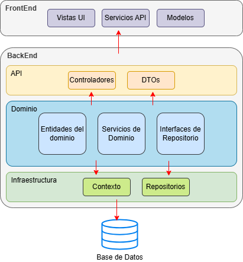

# Medical Center

Medical Center es una aplicación para la gestión de citas médicas. La aplicación está creada con las tecnologías React.js para el frontend y .NET 8 para el backend.

El backend contiene expone los servicios (endpoints) para la autenticación, creación y edición de los usuarios médicos o pacientes y la lógica de negocio correspondiente para que esta información se almacene en una base de datos.


### Configuración
1. Navega a la carpeta del backend:
```bash
cd MedicalCenterAPI
```
2. Restaura las dependencias del proyecto
```
dotnet restore
```
3. Configura la cadena de conexión a la base de datos en el archivo `appsettings.json`:

```
{
  "ConnectionStrings": {
    "DefaultConnection": "Server=TU_SERVIDOR;Database=MedicalCenterDB;Trusted_Connection=True;MultipleActiveResultSets=true"
  }
}
```
Asegúrate de reemplazar `TU_SERVIDOR` con el nombre de tu servidor SQL y `MedicalCenterDB` con el nombre de tu base de datos.

4. Aplica las migraciones para crear la base de datos:

```
dotnet ef database update
```
5. Ejecutar la API:
```
dotnet run
```
La API estará disponible en `https://localhost:7051` o `http://localhost:44313`

### Despliegue
Para desplegar el backend en un servidor, publica el proyecto con el siguiente comando:

```
dotnet publish -c Release -o ./publish
```
Luego, copia los archivos publicados al servidor y configura el entorno de producción.

### Arquitectura 

El backend en .Net 8 con C# es una aplicación de N capas orientada al dominio (DDD) donde, la lógica de negocio se encuentra en la capa de dominio y es independiente de la persistencia y los controladores.

En total en este proyecto se distinguen 3 capas, la capa de dominio, la capa de infraestructura y la capa de presentación o API.



#### Capa de dominio
Contiene las entidades de negocio (User, Patiente, Doctor, City, CivilStatus, Disability, DocumentType, etc.), los servicios que contienen la lógica de las operaciones de estos objetos (Registro, login, CRUDs, Agendamiento de citas, etc.) y las interfaces del patrón Repositorio.


#### Capa de infraestructura
En este caso, la capa de infraestuctura contiene solo dos operaciones: la lógica de creación a la base de datos y la implementación de las interfaces del patrón repositorio.
El patrón repositorio separa la capa de datos de la lógica de negocios de la aplicación, es decir, oculta de las demás capas las operaciones necesarias sobre una base de datos, de forma tal que, las demás capas de la aplicación ignoran cual es la tecnología de base de datos utilizada. Este patrón es ideal cuando la aplicación es suceptible al cambio de motor de base de datos u otras formas de persistir la información.


#### Capa de Presentación - API
La capa de presentación contiene la configuración del proyecto, el patrón de inyección de dependencias para vincular las interfaces con sus respectivas implementaciones y, principalmente los controladores del API REST para comunicar el backend con el front end por los métodos HTTP POST, PUT, GET y DELETE.

Esta capa presenta además la documentación OpenAPI a través de la interfaz swagger, donde se muestran los controladores con sus endpoint, métodos, parámetros de entrada y objetos de respuesta.


### Pruebas unitarias

Cada proyecto del backend tiene su propio proyecto de pruebas.
Se utiliza XUnit y Moq para facilitar su creación.


