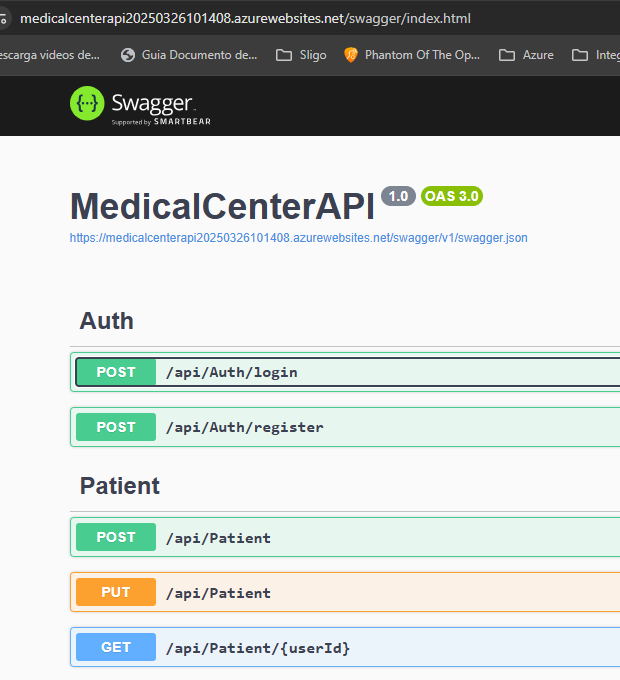

# Medical Center

Medical center es una aplicación para la gestión de citas médicas.

La aplicación está creada con las tecnologías React.js y .Ner 8 para el frontend y backend respecetivamente.

## Backend 
El backend ubicado en la carpeta `MedicalCenterAPI` contiene expone los servicios (endpoints) para la autenticación, creación y edición de los usuarios médicos o pacientes y la lógica de negocio correspondiente para que esta información se almacene en una base de datos.

### Arquitectura 

El backend en .Net 8 con C# es una aplicación de N capas orientada al dominio (DDD) donde, la lógica de negocio se encuentra en la capa de dominio y es independiente de la persistencia y los controladores.

En total en este proyecto se distinguen 3 capas, la capa de dominio, la capa de infraestructura y la capa de presentación o API.

#### Capa de dominio
Contiene las entidades de negocio (User, Patiente, Doctor, City, CivilStatus, Disability, DocumentType, etc.), los servicios que contienen la lógica de las operaciones de estos objetos (Registro, login, CRUDs, Agendamiento de citas, etc.) y las interfaces del patrón Repositorio.

#### Capa de infraestructura
En este caso, la capa de infraestuctura contiene solo dos operaciones: la lógica de creación a la base de datos y la implementación de las interfaces del patrón repositorio.
El patrón repositorio separa la capa de datos de la lógica de negocios de la aplicación, es decir, oculta de las demás capas las operaciones necesarias sobre una base de datos, de forma tal que, las demás capas de la aplicación ignoran cual es la tecnología de base de datos utilizada. Este patrón es ideal cuando la aplicación es suceptible al cambio de motor de base de datos u otras formas de persistir la información.