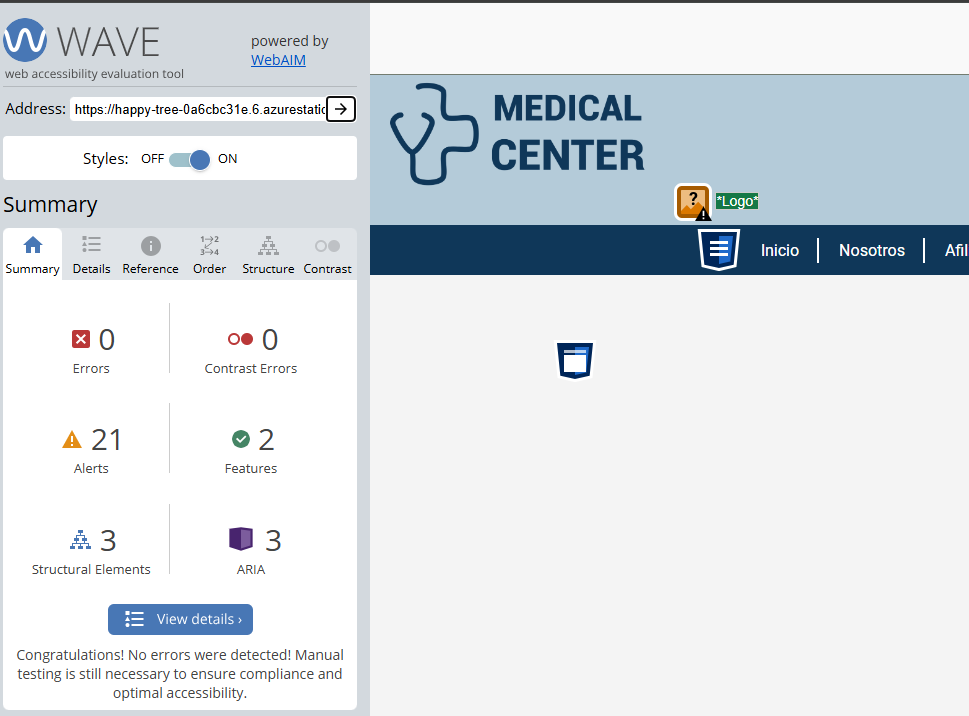
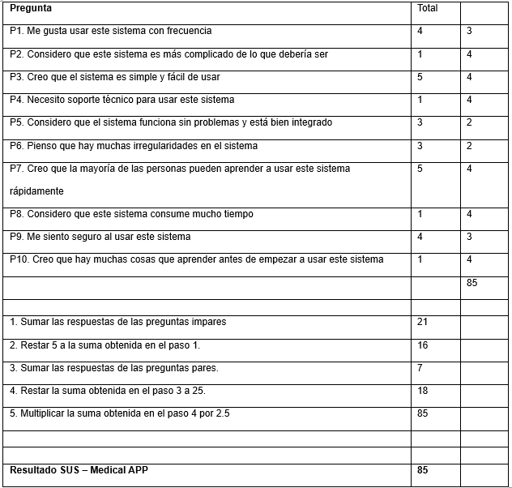
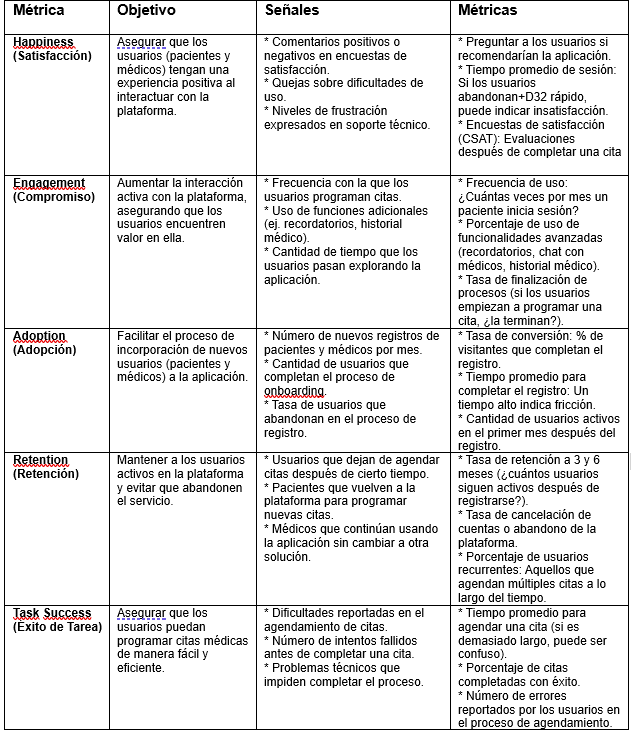
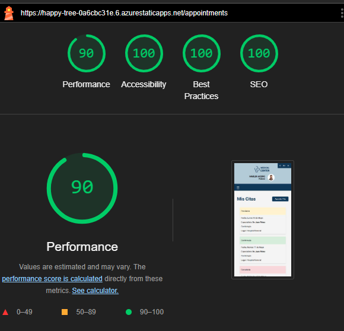
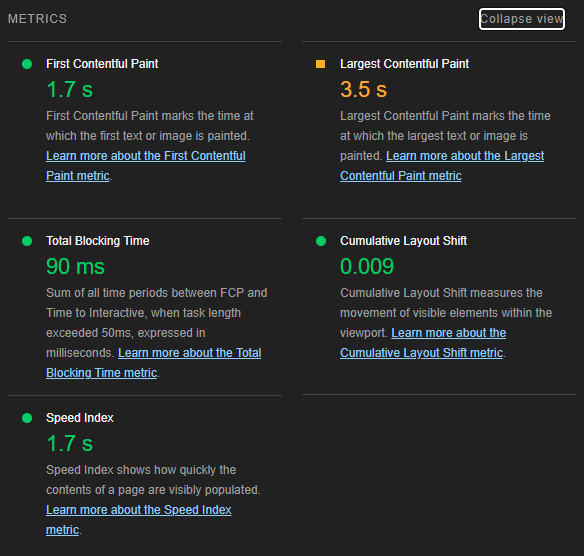
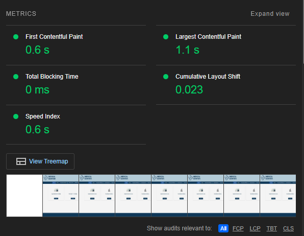
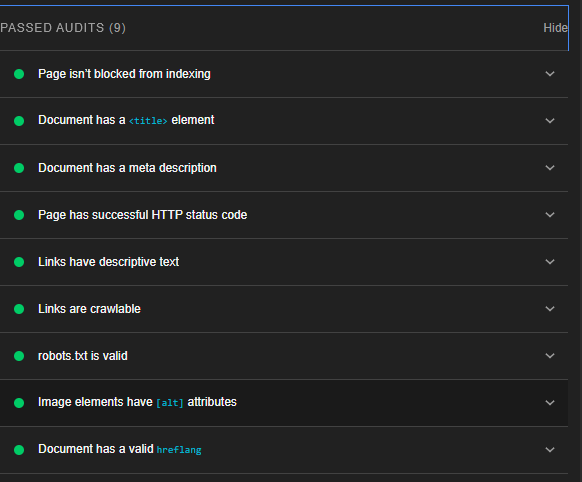

# Pruebas de Usabilidad
Se realizan pruebas de usabilidad para identificar problemáticas específicas dentro de la aplicación y el comportamiento de los usuarios durante cada proceso. 

## Wave
Se somete la página a validación con wave. El resultado: https://wave.webaim.org/report#/https://happy-tree-0a6cbc31e.6.azurestaticapps.net/home

## Encuesta de Usabilidad SUS
Mediante la encuesta SUS (System Usability Scale) se puede evaluar la usabilidad del sistema de forma rápida (Busquets, Medir la usabilidad con el Sistema de Escalas de Usabilidad (SUS), s.f.). A partir de una puntuación de 1 a 5, donde 1 es Totalmente en desacuerdo y 5 Totalmente de acuerdo, se han calificado cada uno de los aspectos sugeridos por la encuesta, de donde se obtiene el siguiente resultado:

		
Resultado SUS – Medical APP	85	

De acuerdo con el sistema de medición propuesto se ha obtenido una puntuación alta (71-100), es decir, la usabilidad del sistema es aceptable, pero se pueden hacer varias mejoras para lograr la excelencia de la aplicación, en especial asegurar que los módulos creados funcionan correctamente y evitar el reporte de errores que pudieron haberse previsto.

## Modelo HEART
Con el modelo HEART diseñado por Google se puede obtener información relevante para mejorar la experiencia de los usuarios (Busquets, Utiliza el método HEART de Google para medir UI/UX, s.f.). 

1.3.	Lighhouse
El objetivo de Lighthouse es proporcionar orientación relevante y práctica para todos los desarrolladores web. Para ello, hay dos funciones disponibles que te permiten adaptar Lighthouse a tus necesidades específicas.

Más detalle de las pruebas en 
[Resultados de Lighthouse](./happy-tree-0a6cbc31e.6.azurestaticapps.net_2025-03-27_21-59-00.report.html)

## Áreas de mejora
Según la evaluación de la aplicación mediante el Modelo HEART se sugieren las siguientes oportunidades de mejora:
* Optimizar la navegación con una interfaz más intuitiva y accesible.
* Reducir la carga cognitiva con flujos de usuario más simples y guías visuales.
* Implementar asistencia interactiva (chatbots, preguntas frecuentes, soporte en vivo).
* Aumentar las opciones de accesibilidad para usuarios con discapacidades visuales y motoras.
* Mejorar la adopción con un onboarding simplificado y tutoriales interactivos.
